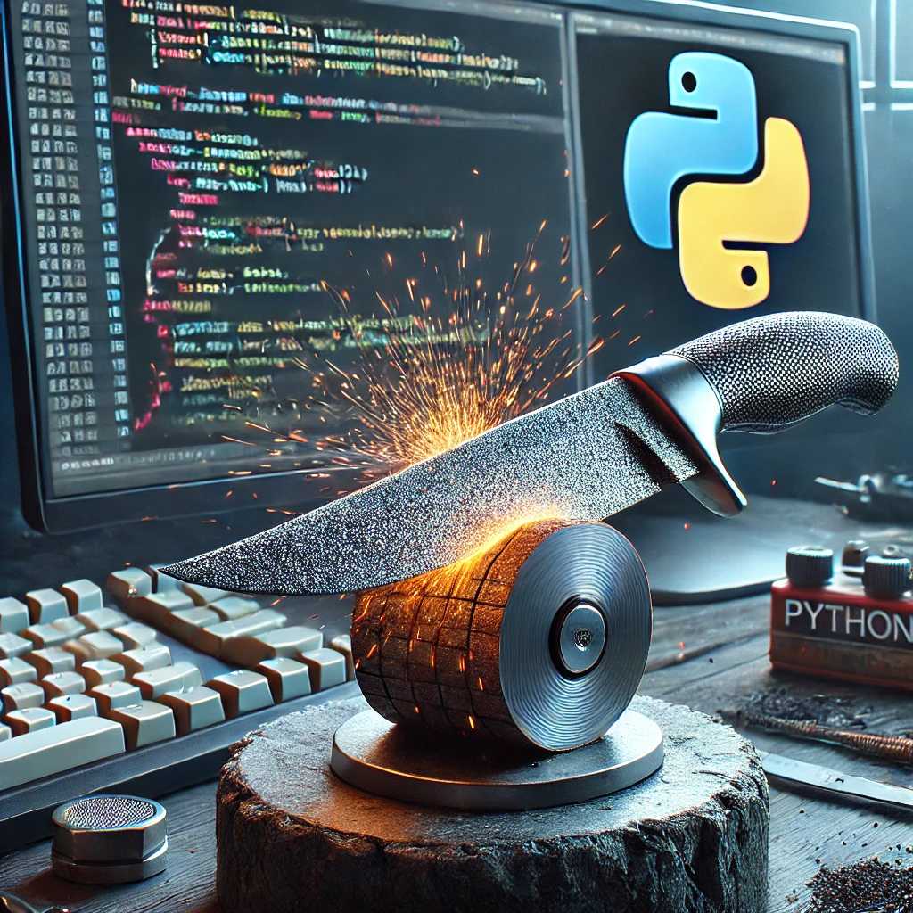

## Test Your Knowledge Practice 2


This repo allows you to practice the basics of Python that you have just learned. Albeit tedious, it is good to understand the basics before you jump to more difficult concepts. This allows you to become a stronger developer. 




### Complete the following exercises to test your knowledge of what you've just learned.
When necessary, use the [Lesson](https://github.com/jdrichards-pursuit/week-3.2-python-theory/blob/main/lesson.ipynb) as a reference.


Before you start, make sure you create your virtual environment.

```
python3 -m venv .venv
source .venv/bin/activate
```
Choose 'yes' when prompted to include the `venv` in your workspace.

Remember to choose `Install` when prompted to install the `ipykernel` package.


**Note** In the bottom right corner of the screen, hover over the `Cursor Tab` and in the box, choose `Disable Globally`. Also choose `disabled` in the `Cursor Prediction` dropbox. This will enable you to create the code on your own without the help of Cursor. Creating the functions yourself will help you learn the material.


## Begin the Exercises

Navigate to the [`exercises.ipynb`](./exercises.ipynb) file and start the exercises.

Good luck!

## Links

- [Exercises](./exercises.ipynb)

- [Lesson](https://github.com/jdrichards-pursuit/week-3.2-python-theory/blob/main/lesson.ipynb)

## Materials:

- [Python Data Types - Official Documentation](https://docs.python.org/3/library/stdtypes.html)
- [Python Strings - GeeksforGeeks](https://www.geeksforgeeks.org/python-strings/)
- [Python String Methods - W3Schools](https://www.w3schools.com/python/python_strings_methods.asp)
- [Python Operators - W3Schools](https://www.w3schools.com/python/python_operators.asp)